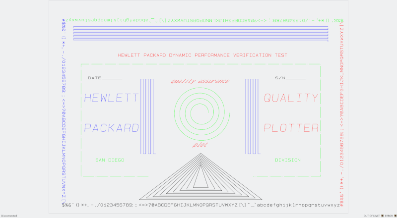

9872
====

"9872" is an emulator of HP9872C graphic plotter. It connects to MAME through the IEEE-488 remotizer.

## Installation

9872 is composed of the following files:

+ `9872.py`
+ `pendialog.py`
+ `pen_dialog.py`
+ `plot9872.py`
+ `resources.py`

These files must be placed in the same directory. The emulator also needs `rem488.py` from HP disk emulator. You can either copy it over to 9872 directory or set the `PYTHONPATH` environment variable to point to HP disk directory.

9872 is written in Python 3. It requires the [PyQt5 library](https://www.riverbankcomputing.com/software/pyqt/download5) which can be installed with `pip install PyQt5`.

## Usage

9872 is run by launching `9872.py` in the Python 3 interpreter. It takes two optional parameters to set the TCP port where it listens for connection (`-p port`) and to set the HPIB address of plotter (`-a addr`). By default port 1234 and address 5 are used.

9872 is to be run before starting MAME. It waits for a connection from MAME remotizer on TCP port specified by `-p` command line option.

The GUI layout is quite simple: most of the window is occupied by the "paper sheet" with plotter output. At the bottom right corner the 2 LED indicators are simulated.

By right-clicking on the sheet a popup menu is shown. These commands are available:

+ `Save`: save the current image in SVG format

+ `Clear`: place a new, clean sheet on the plotter plate

+ `Log HPGL`: log HPGL commands to a file

+ `HPGL playback`: replay HPGL commands from a file

+ `Set pens`: configure color and size of pens.

Default color/size of pens is as follows.

| *No* | *Color*    | *Size* |
|------|------------|--------|
| 1    | Black      | .5 mm  |
| 2    | Red        | .5 mm  |
| 3    | Green      | .5 mm  |
| 4    | Blue       | .5 mm  |
| 5    | Cyan       | .5 mm  |
| 6    | Magenta    | .5 mm  |
| 7    | Yellow     | .5 mm  |
| 8    | Light gray | .5 mm  |

## Change history

+ 1.0: first release

+ 1.1: log/playback and pen setting commands added
