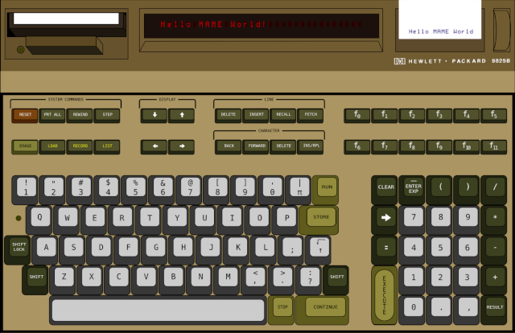

# HP9825T layout #

Author: F.Ulivi

License: CC-BY-SA

This layout enhances the interaction with HP9825T emulation. It shows keyboard, cassette drive, LED display and thermal printer.

## Acknowledgments ##

I'd like to thank Craig Ruff and "jbemond" who took for me some nice pictures of real 9825 machines. My layout is based on their pictures.

## Installation ##

The following files are to be copied to a directory named `hp9825t` which, in turn, should be under a directory in the artwork search path (`artwork` in the MAME main directory by default).

  * `hp9825t.lay`

  * `cassette.png`

  * `layout.png`

Alternatively, these files can be compressed into `hp9825t.zip` which should then be placed in a directory in the artwork search path.

## Usage ##

All keys on the keyboard are active, including RESET. Keys are "pressed" by clicking with mouse.

Cassette drive is displayed in two states: with cassette and without it. Loading and unloading a cassette happens through the usual UI menu.

The printer displays a window of 6 lines. Internally the last 24 printed lines are stored. By clicking on the top or bottom half of the paper advance knob the window can be moved up & down over the whole output image.

## Possible enhancements ##

  * Better interaction with cassette drive: clicking on the eject button should unload the cassette and clicking on the drive door should bring up the load menu.

  * Use the correct font for all the lettering on the keys.
