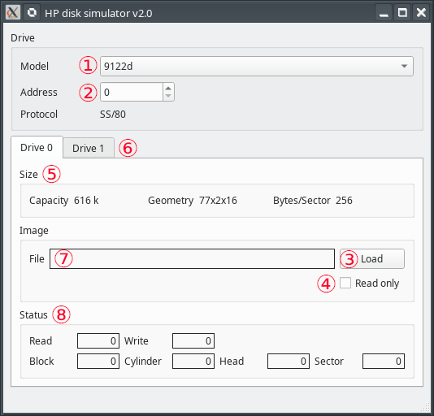

HP Disk
=======

"HP disk" is a GUI-based tool that emulates HPIB disk drives. It emulates a few models that use the "Amigo" protocol and it connects to MAME emulator through the IEEE-488 remotizer.

This is the current list of emulated drives.

| Model name | Units per drive | Raw capacity per unit |
| -----------|-----------------|-------------------|
| 9134b      | 1               | 9.26 MiB |
| 9895       | 2               | 1.13 MiB |
| 82901      | 2               | 264 KiB |

## Installation

HP disk is composed of the following files:

+ `hp_disk.py`
+ `hp_disk_protocol.py`
+ `main.py`
+ `rem488.py`

These files must be placed in the same directory.

HP disk is written in Python 3. It requires the [PyQt5 library](https://www.riverbankcomputing.com/software/pyqt/download5). It can run on any platform where a Python 3 interpreter and the Qt5 library are available.

## Usage

HP disk is run by launching `hp_disk.py` in the Python 3 interpreter.

HP disk is to be run before starting MAME. It waits for a connection from MAME remotizer on 1234 TCP port.

The following figure shows the main elements of the GUI interface.

1. This combo box selects the drive model to be emulated. It can only be selected when HP disk is disconnected.

2. This field selects the HPIB address of drive in range [0..7]. It can only be changed when HP disk is disconnected.

3. These buttons open the file selection dialog where the image file to be loaded into each unit can be chosen. Once an image file is loaded (field #7 is not empty) the button turns into "unload". Pressing it again unloads the emulated disk and resets the button back to "load".

4. This check box selects the read-only or read-write mode of a disk. It is to be set before loading an image.

5. These fields display a summary of the emulated drive data.

6. This field flashes red whenever the emulated drive is accessed by the host.

7. These fields display the name of image file (when loaded).

8. This section displays some statistics about each unit (total count of R/W sectors & current position).

See also the usage instructions for `amigo_drive`.

### HP85

Add these options when invoking MAME:

`-slot1 82937_hpib -rom1 mass -slot4:82937_hpib:ieee_rem remote488 -bitb1 socket.localhost:1234`

### HP86B

Add these options when invoking MAME:

`-slot1:hpib:ieee_rem remote488 -bitb socket.localhost:1234`

### HP9845B/C/T

Add these options when invoking MAME:

`-rom1 massd -slot0 98034_hpib -slot0:98034_hpib:ieee_rem remote488 -bitb1 socket.localhost:1234`

### HP9825T

Add these options when invoking MAME:

`-rom1 mass2 -slot0 98034_hpib -slot0:98034_hpib:ieee_rem remote488 -bitb3 socket.localhost:1234`

HP9825T can only access HP9895 drives. This command is needed before accessing disk in unit 0: `drive 0,700`.

### HP64000

Add these options when invoking MAME:

`-ieee_rem remote488 -bitb socket.localhost:1234`

HP64000 can only access the 9134b model at bus address = 0. In order to boot from HD the "System source" DIP switch should be set to "Sys bus".

### HP IPC

Add these options when invoking MAME:

`-ieee_rem remote488 -bitb socket.localhost:1234`

## Change history

+ 1.0: first release
